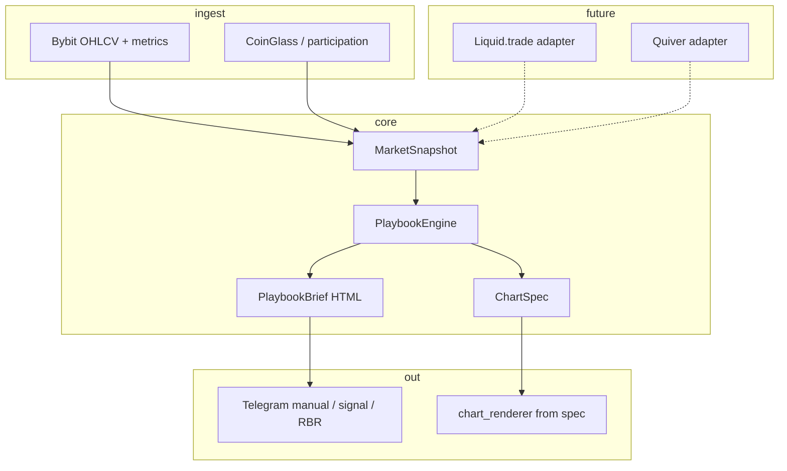

# Ed Terminal / Playbook v3 — план разработки

> Живой документ: отмечай `[x]` по мере готовности. North Star — один «мозг» разбора монеты, без противоречивых слоёв на графике и в тексте.

## North Star

**Ed Terminal** — intraday-терминал для фьючерсов (далее Liquid.trade: crypto + stocks + prediction markets) и **alt-data** (Quiver Quant: congress, insider, flows). Сейчас фокус: **Bybit perps**, ручной `/ta`, RBR WATCH, сигнальный канал.

Пользователь получает:

1. **Одну карточку INTEL** — состояние `OBSERVE | ARMED | NO_TRADE`, 1–3 фразы «где мы / что ждём», матрица потока (цена · OI · CVD · ликвидации) когда данные есть.
2. **Один PNG** — только структура (диапазон, пол/потолок, паттерн, SMC/FVG по политике), **без** TP/IN/SL по умолчанию.
3. **Алерты** только когда план **не stale** и фаза RBR/триггер согласованы с ценой.

---

## Принципы (не нарушать)

| # | Правило |
|---|---------|
| P1 | Один источник правды: `PlaybookEngine` → `PlaybookResult` (brief + chart_spec + alert_eligible). |
| P2 | Scanner / pipeline — **события**, не второй «анalyst». |
| P3 | Устаревший план → `NO_TRADE` + без WATCH-алерта (`plan_staleness`). |
| P4 | TV overlay: Y вниз = дешевле, окно = `display_hours` / `zoom_hours`. |
| P5 | Elliott / wave / legacy captions — не в авто-алертах без явного флага. |
| P6 | Минимальный diff; новое — за env-флагами, пока не стабилизируем. |

---

## Env-профиль (Ed, production-like)

```env
ED_PLAYBOOK_V3=1
ED_MINIMAL_VOICE=1
ED_CHART_TRADE_PLAN=0
ED_CHART_PDF_ZONES=0
ED_CHART_ENTRY_TAGS=0
ED_SIGNAL_LEGACY_READING=0
ED_CHART_SPEC_LAYERS=1
# Опционально: SIGNAL_CHART_SOURCE=annotated  # 1:1 бары, пока TV калибруется
```

---

## Архитектура (7 слоёв)



### Слои

1. **Ingest** — свечи, OI/CVD/liq строки, доменный контекст (`analysis_context_plugins`).
2. **Snapshot** — `bot/core/snapshot.py`: нормализованный срез для engine.
3. **Playbook** — `bot/core/playbook/`: states, engine, brief, chart/spec.
4. **Render** — `chart_renderer` / TV overlay читают политику + (постепенно) `ChartSpec`.
5. **Delivery** — `living_analysis`, `signal_pipeline`, `telegram_bot`.
6. **Adapters** — `bot/adapters/liquid_trade/`, `bot/adapters/quiver/` (interfaces + mock).
7. **Quality** — pytest, visual spot-check на BRUSDT/CARVUSDT/BZUSDT/FLOKI.

---

## PlaybookResult (контракт)

| Поле | Назначение |
|------|------------|
| `state` | `observe` \| `armed` \| `no_trade` |
| `headline_ru` | Одна строка для push |
| `body_html` | Telegram HTML |
| `intel_rows` | До 4 строк: цена, OI, CVD, liq |
| `alert_eligible` | RBR WATCH / signal gate |
| `chart_spec` | Уровни, range, паттерн-id, флаги слоёв |
| `block_reason` | Почему NO_TRADE (stale, нет данных) |

---

## Roadmap

### Q1 — Foundation (текущий спринт)

- [x] Fix TV coords, staleness, chart trade plan off by default (см. git working tree).
- [x] `docs/ED_TERMINAL_V3_PLAN.md` (этот файл).
- [x] `bot/core/snapshot.py`, `bot/core/playbook/*` — engine + brief.
- [x] `living_analysis` → playbook при `ED_PLAYBOOK_V3=1`.
- [x] `rbr_alert_eligible` согласован с `PlaybookResult.alert_eligible`.
- [x] `format_rbr_alert_caption_html` → thin wrapper над playbook brief.
- [x] Unit tests: `test_playbook_engine.py`.
- [x] Adapter stubs: Liquid.trade, Quiver.

### Q2 — Chart from spec

- [x] `chart_renderer` — zoom через playbook `ChartSpec.display_hours` (+ cache на `ta.market_metrics`).
- [x] `chart_ed_story` / TV probable path — gated `ED_CHART_TRADE_PLAN=0` (projections off).
- [x] Единый `display_hours` из playbook (`resolve_chart_zoom_hours`).
- [x] TV overlay: spec-path (`try_draw_tv_playbook_layers` + `draw_playbook_spec_tv`).
- [x] MPL pro chart: `draw_mpl_playbook_layers` в `chart_pro.draw_pro_layers`.
- [~] **100% spec:** при `legacy_manual` / `SIGNAL_CHART_LEGACY=1` / `ED_CHART_SPEC_LAYERS=0` остаётся старый pro/ed_story.

### Q3 — Pipeline slim

- [x] `scenario_body_html` — при `ED_PLAYBOOK_V3` + `ED_SIGNAL_LEGACY_READING=0` только living/playbook.
- [~] **Единый dispatch:** stamp + `playbook_rbr_watch` в `dispatch_signal`; **ещё отдельно** `assess_signal_quality`, `decide_trade_action`, `trade_decision_gate`, `signal_quality_gate` (не сведены в один `PlaybookResult`-filter).
- [x] Legacy reading в алертах off при v3 (`ED_SIGNAL_LEGACY_READING=0`).
- [x] Manual TA INTEL: 4-panel матрица в playbook brief (`📊 INTEL`).

### Q4 — Multi-asset

- [~] Liquid.trade: mock + `MarketSession` в `bot/adapters/liquid_trade/` — **не подключено** к ingest/snapshot.
- [~] Quiver: `quiver_intel_line()` в engine (только если `resolve_asset_flags().quiver_intel`; mock возвращает пусто).
- [x] Feature flags per asset class (`bot/core/asset_class.py`, meta на ChartSpec).
- [x] TV + MPL spec-path (`ED_CHART_SPEC_LAYERS=1` по умолчанию при v3).

### Q5 — Full plan closure

- [x] MPL annotated/signal chart from spec (см. Q2).
- [~] `dispatch_signal` gates (см. Q3 — не полная замена pipeline).
- [x] Legacy UX redirects: `enrich_ta_scenario_fields`, `ta_signal_caption_html`, `build_human_trade_brief_html`.
- [~] Quiver в INTEL (код есть, данных нет без API).
- [ ] Реальные API Liquid.trade / Quiver.
- [ ] Ручной spot-check (BRUSDT/CARVUSDT/BZUSDT/FLOKI) + перезапуск бота в prod.

---

## Deprecations (целевое состояние)

| Legacy | Замена |
|--------|--------|
| Разрозненные `build_*_html` ветки | `format_playbook_brief_html` |
| TP/IN/SL на PNG по умолчанию | `ED_CHART_TRADE_PLAN=0`, зоны в тексте по запросу |
| `ta_analysis` как «всё в одном» для UX | TA остаётся **data**, UX только через playbook |
| Дубли RBR story в 5 модулях | `effective_rbr` + playbook narrative |

**Статус deprecations:**

| Legacy | Статус |
|--------|--------|
| `build_*_html` / scenario / situational | [~] Обход playbook при v3; файлы **не удалены** |
| TP/IN/SL на PNG | [x] Default off (`ED_CHART_TRADE_PLAN=0`) |
| `ta_analysis` → UX | [~] TA = data; UX через playbook при v3 |
| RBR story дубли | [~] `living_analysis` legacy при v3=0 |

---

## Чеклист перед релизом в Telegram

- [ ] Перезапуск бота после деплоя (старые PNG в кэше чата не обновятся).
- [x] Автотесты v3 (**2026-10-09**, **28 passed**): playbook, staleness, tv_coords, display_policy, RBR alert, living, asset_class, ta_playbook_caption.
- [ ] Ручная проверка: `await_break` — пол/потолок на PNG, текст без «ВХОД» у потолка.
- [ ] Ручная проверка: `fade_top` + цена ниже пола → `NO_TRADE`, WATCH не уходит.

---

## Аудит North Star и принципов (2026-10-09)

| Критерий | Статус | Комментарий |
|----------|--------|-------------|
| **1. Карточка INTEL** | [x] | Состояния + `📊 INTEL` 4 строки в playbook brief |
| **2. PNG структура** | [~] | Spec TV+MPL при `ED_CHART_SPEC_LAYERS=1`; legacy fallback |
| **3. Алерты без stale** | [x] | `plan_staleness` + `alert_eligible` |
| **P1** PlaybookEngine | [~] | Engine есть; quality/decision gates параллельно |
| **P2** scanner = события | [~] | Полный TA на сигнале сохранён |
| **P3** stale | [x] | |
| **P4** TV coords | [x] | |
| **P5** Elliott alerts | [x] | Не в signal caption path |
| **P6** env-флаги | [x] | |

### Модули core

`snapshot`, `asset_class`, `playbook/{engine,brief,chart_spec,chart_draw,chart_mpl_spec,chart_layers,cache,signal_dispatch}`, `adapters/{liquid_trade,quiver}` (mock).

### Точки входа (grep)

`living_analysis` · `telegram_bot.dispatch` · `chart_pro.draw_pro_layers` · `chart_tv_pro_overlay.draw_tv_pro_layers` · `rbr_alert_eligible` → playbook.

---

## Ссылки в репо

| Область | Файлы |
|---------|--------|
| TV / coords | `bot/chart_tv_coords.py`, `bot/chart_tv_pro_overlay.py` |
| Staleness | `bot/plan_staleness.py`, `bot/range_breakdown_retest.py` |
| Политика UI | `bot/chart_display_policy.py` |
| Текст | `bot/living_analysis.py`, `bot/minimal_ed_voice.py` |
| TA data | `bot/ta_analysis.py`, `bot/signal_pipeline.py` |
| TZ (legacy vision) | `docs/TZ.md` |
| Skill разбора графиков | `.cursor/skills/crypto-chart-analysis/SKILL.md` |

---

*Последнее обновление: 2026-10-09 — аудит выполнения: Q1–Q5 код готов, prod/API/ручные проверки — открыты.*

**Легенда:** `[x]` сделано · `[~]` частично · `[ ]` не сделано / только вручную.
